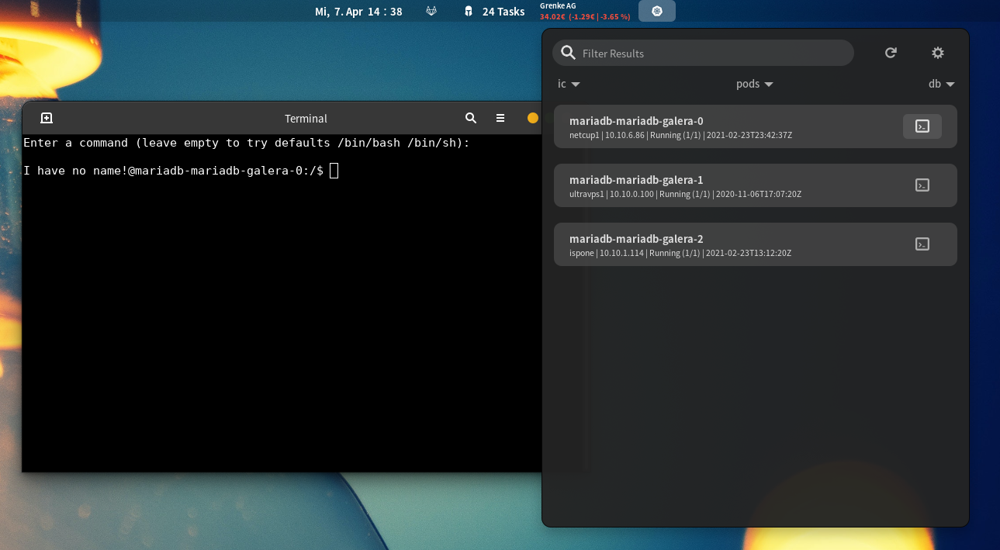
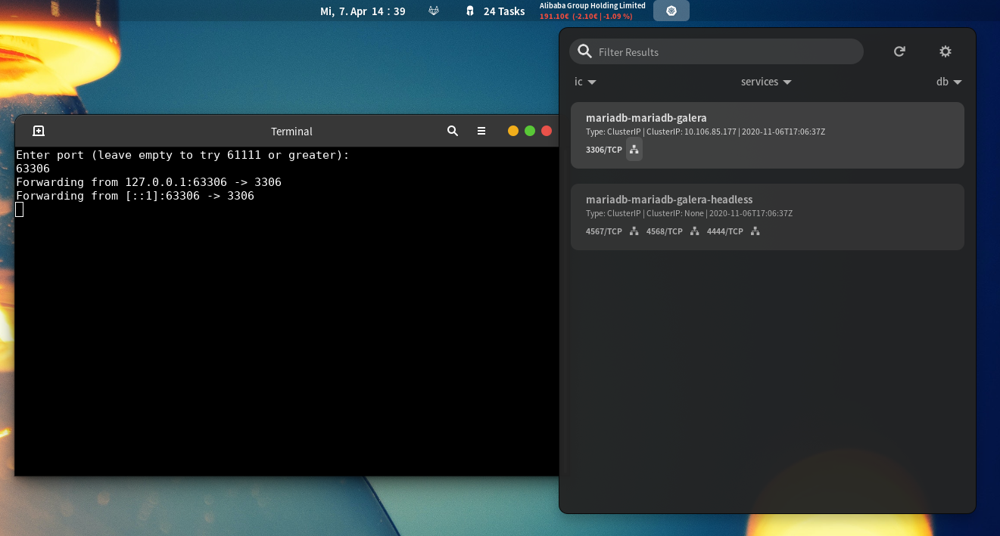

# [kubectl-extension](https://extensions.gnome.org/)

An extension for quick access kubernetes resources in GNOME Shell panel utilizing kubectl CLI

----

## Installation

### Over extensions.gnome.org (EGO)

Install via install button -> TBA

### Generic (Local installation)

Move files into your locale extension directory (~/.local/share/gnome-shell/extensions/kubectl@infinicode.de) and enable
the extension via the Tweak Tool, it is **important** to move it to **kubectl@infinicode.de** otherwise the extension
will not be recognized by GNOME. Restart GNOME Shell (`Alt`+`F2`, `r`, `Enter`) and enable the extension through *
gnome-tweak-tool* or *extensions tool*.

## Data Provider

Data is used from [`kubectl CLI`](https://kubernetes.io/docs/reference/kubectl/overview/), make sure you have it
installed.

## Context usage

The extension uses kubectl contexts, so make sure you have a valid kube configuration. See
also https://kubernetes.io/docs/tasks/access-application-cluster/configure-access-multiple-clusters/

